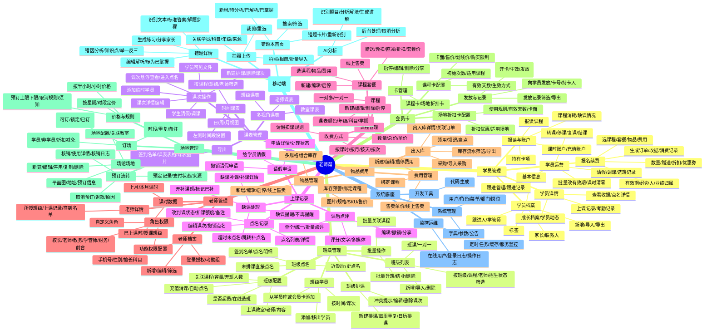
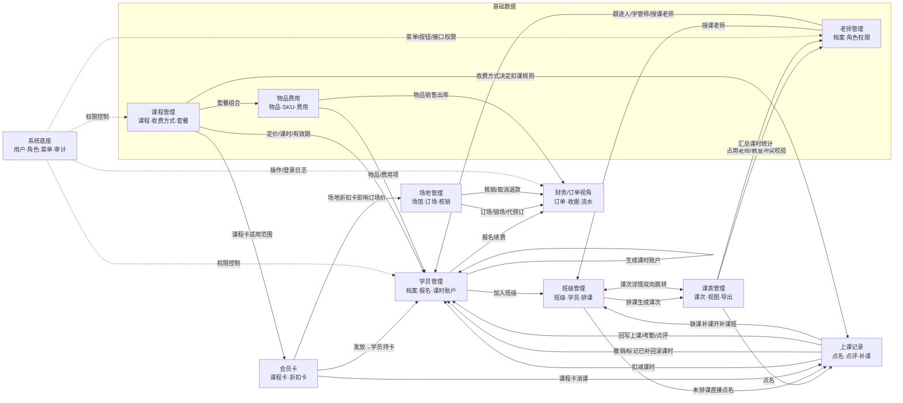
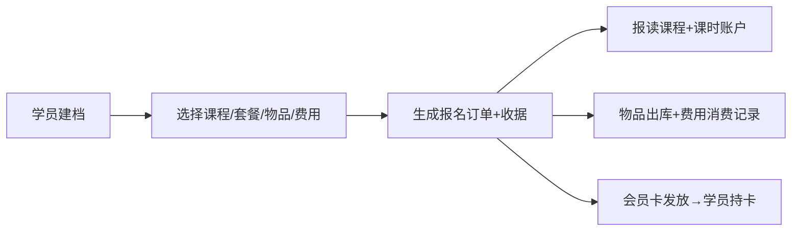
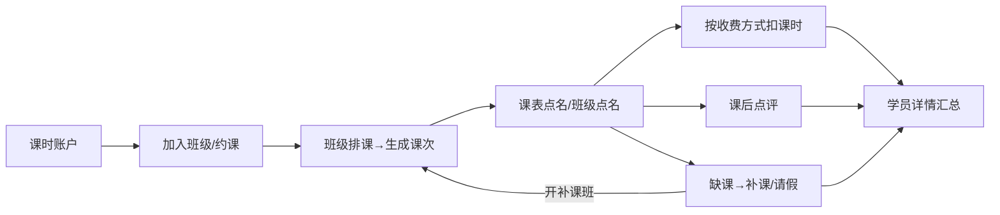
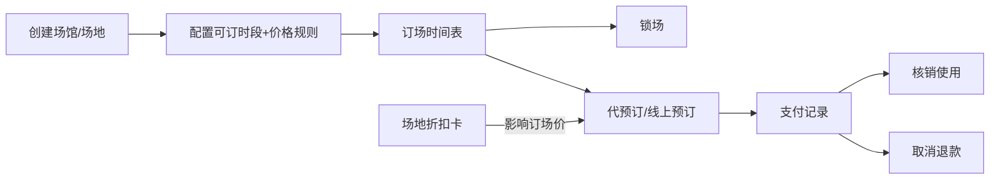
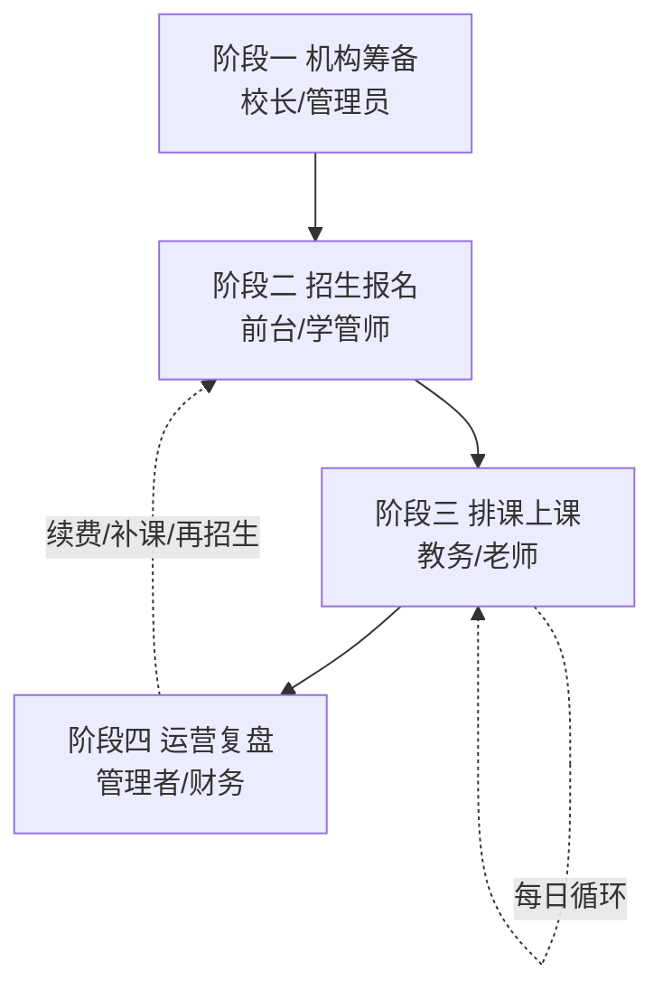

# 老师帮 — 功能架构脑图

> 生成时间：2026-06-24
> 整理依据：`doc/产品图片` 全部 9 个原型目录及各模块目录内的 `*_模块总结报告.md`、`doc/产品资料/老师帮-后台功能结构图.md`、`mobile-promete/`（移动端原型）。
> 用途：梳理**整个项目有哪些模块、每个模块有哪些功能、功能之间如何关联**。只描述功能架构，不含完成度判断（PC 前端进度见 `PC端前端进度.md`，后端进度见 `后端进度.md`）。
> 口径：PC 管理端按 9 个业务模块；AI 错题本为移动端专属能力；系统底座为 RuoYi 风格权限与审计平台。

---

## 一、功能架构总脑图

---

## 二、模块/功能关联图（核心数据流）

---

## 三、三条核心业务闭环

### 1. 招生报名闭环（钱进来）

### 2. 教学消课闭环（课消耗）

### 3. 场地预订闭环（场地变现）

---

## 四、功能架构分层说明

| 层次 | 模块 | 角色 |
| --- | --- | --- |
| **基础数据层** | 课程管理、物品费用、老师管理 | 提供报名、建班、排课的底层主数据 |
| **资产/权益层** | 学员管理、会员卡 | 学员档案、课时账户、卡权益等可消耗资产 |
| **教学运营层** | 班级管理、课表管理、上课记录 | 教学主链路：建班→排课→点名→消课→点评→补课 |
| **场地变现层** | 场地管理 | 独立变现域，依赖会员卡折扣卡 |
| **智能工具层** | AI 错题本（移动端） | 教学增值能力，独立于消课主链路 |
| **平台底座层** | 系统底座 | 用户/角色/菜单/字典/日志/监控，支撑全模块权限与审计 |

> 关键耦合点：**课程管理**（决定报名定价与扣课规则）、**学员课时账户**（招生与消课的交汇点）、**点名/上课记录**（课时余额的唯一变更入口）、**会员卡**（横跨课程消课与场地折扣两域）。

---

## 五、标准操作流程（SOP）

> 按「先搭基础数据 → 再招生 → 再排课上课 → 再运营复盘」的顺序。前一阶段是后一阶段的前置条件，例如：没有课程就不能建班，没有课时账户就不能消课。

### 流程总览

### 阶段一：机构筹备（先把"底子"搭好）

> 角色：校长 / 管理员。目标：把课程、老师、物品、班级等基础数据准备齐。

1. **建组织与权限**（系统底座）：建用户、配角色（校长/教务/学管师/财务/前台）、分配菜单与按钮权限。
2. **录入老师**（老师管理）：新增老师档案 → 开通登录授权 → 绑定角色与功能权限。
3. **建课程与定价**（课程管理）：新建课程 → 配置收费方式（按课时/按月/按天/按次、单价、请假扣课规则）。这一步决定后续报名金额和点名扣课规则。
4. **建套餐**（可选，课程管理）：把课程 + 物品 + 费用打包，设赠送/折扣/套餐价。
5. **备物品与费用**（物品费用）：新增物品/SKU、采购入库；新建费用项目。供报名时选购。
6. **配会员卡**（可选，会员卡）：建课程卡 / 场地折扣卡，设适用范围、次数、有效期、售价。
7. **配场地**（可选，场地管理）：建场馆 → 建场地 → 配可订时段与价格规则。
8. **建班级**（班级管理）：新增班课/一对一，关联课程、授课老师、上课教室、容量、开班人数。

### 阶段二：招生报名（把学员和钱收进来）

> 角色：前台 / 学管师。目标：学员建档并完成报名，生成课时账户。

1. **学员建档**（学员管理）：新增学员，填基本信息、家长/联系人、标签，指定跟进人/学管师。
2. **跟进转化**（学员管理-跟进记录）：记录每次跟进（方式、阶段、内容、下次跟进时间），推动到报名。
3. **报名/续费**（学员管理-报名续费）：选课程/套餐/物品/费用 → 设数量/赠送/折扣/有效期/经办人 → 提交。
   - 系统自动：生成报名订单 + 收据 + 消费记录、生成**报读课程与课时账户**、物品走销售出库。
4. **入班或发卡**：把学员加入对应班级（班级管理-班级学员）；如售卡则发放会员卡 → 沉淀到学员"持有卡"。

### 阶段三：排课上课（每日核心循环）

> 角色：教务（排课）/ 老师（点名）。目标：把课时真正消耗掉并记录教学结果。

1. **排课**（班级管理-班级排课 或 课表管理-新建排课）：按班级生成课次，支持每周重复/日历排课，系统做老师/教室/时间**冲突校验**。
2. **看今日课**（课表管理 / 移动端今日工作台）：老师查看当天课次、应到学员、待处理。
3. **点名考勤**（上课记录 / 班级点名 / 移动端点名）：标到课/迟到/请假/未到 → 按收费方式**扣减课时**。
4. **课后点评**（上课记录-课后点评）：单个/批量点评，评分 + 文字 + 多媒体，可分享家长。
5. **异常处理**：临时学员、学生请假、单生调课（课表管理）；撤销点名、修改扣课额度（上课记录）。
6. **缺课跟进**（上课记录-缺课处理）：缺课提醒 → 开补课班 → 标记已补；超时未点名提示补点名。

> 移动端老师每日最短路径：**今日工作台 → 课表 → 点名 → 课后点评/AI 错题本 → 我的**。

### 阶段四：运营复盘（看数据、催续费、保安全）

> 角色：管理者 / 财务。目标：盯住课消、续费、老师课时和账实一致。

1. **教学复盘**（上课记录）：核对点名记录、超时未点名、缺课补课，确保课次都已处理。
2. **学员维护**（学员管理-详情）：看课消/剩余课时，临近耗尽触发**续费**（回到阶段二）；处理转课/停课/结课。
3. **老师结算**（老师管理）：查本月课时、授课班级，作为课时统计/绩效依据。
4. **场地经营**（可选，场地管理）：订场、锁场、代预订、核销、取消退款。
5. **账实核对**（物品费用 / 财务视角）：查库存流水、采购/销售出入库、费用消费记录。
6. **安全审计**（系统底座）：查操作日志、登录日志，关注撤销点名、改有效期、退款等敏感操作。

### 角色—阶段职责速查

| 角色 | 主要阶段 | 关键动作 |
| --- | --- | --- |
| 校长/管理员 | 阶段一 + 阶段四审计 | 权限分配、基础数据搭建、运营决策 |
| 教务 | 阶段一建班 + 阶段三排课 | 建班、排课、冲突处理、调课 |
| 学管师/前台 | 阶段二 | 学员建档、跟进、报名续费、入班发卡 |
| 老师 | 阶段三 | 点名、课后点评、错题本、缺课跟进 |
| 财务 | 阶段四 | 订单、收据、库存流水、退款核对 |
