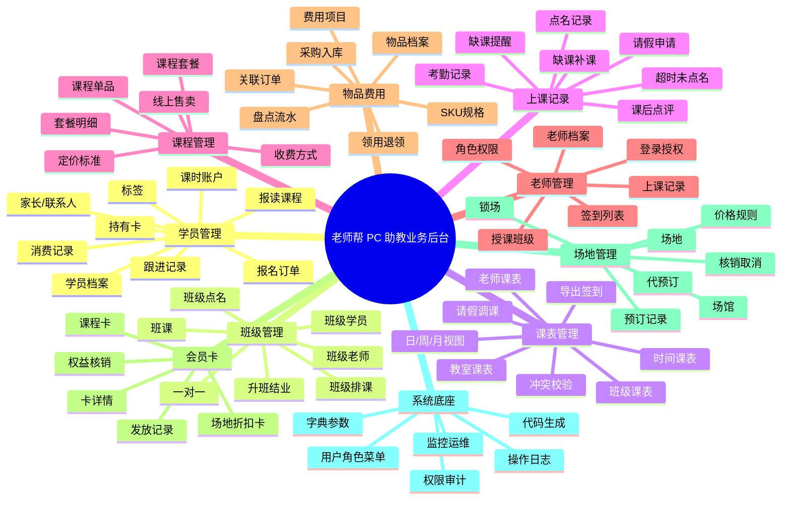
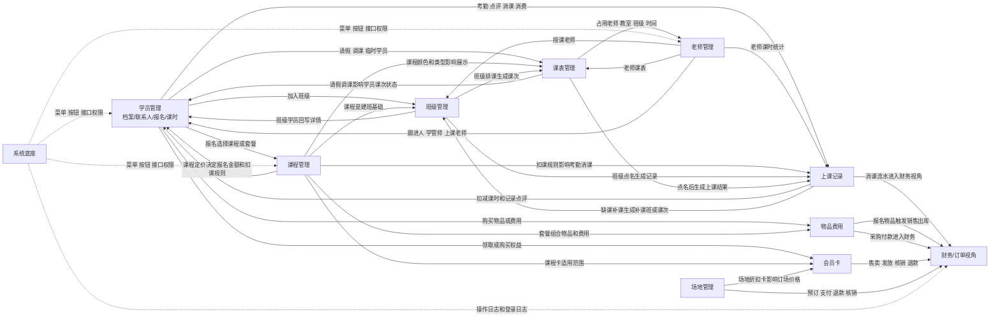
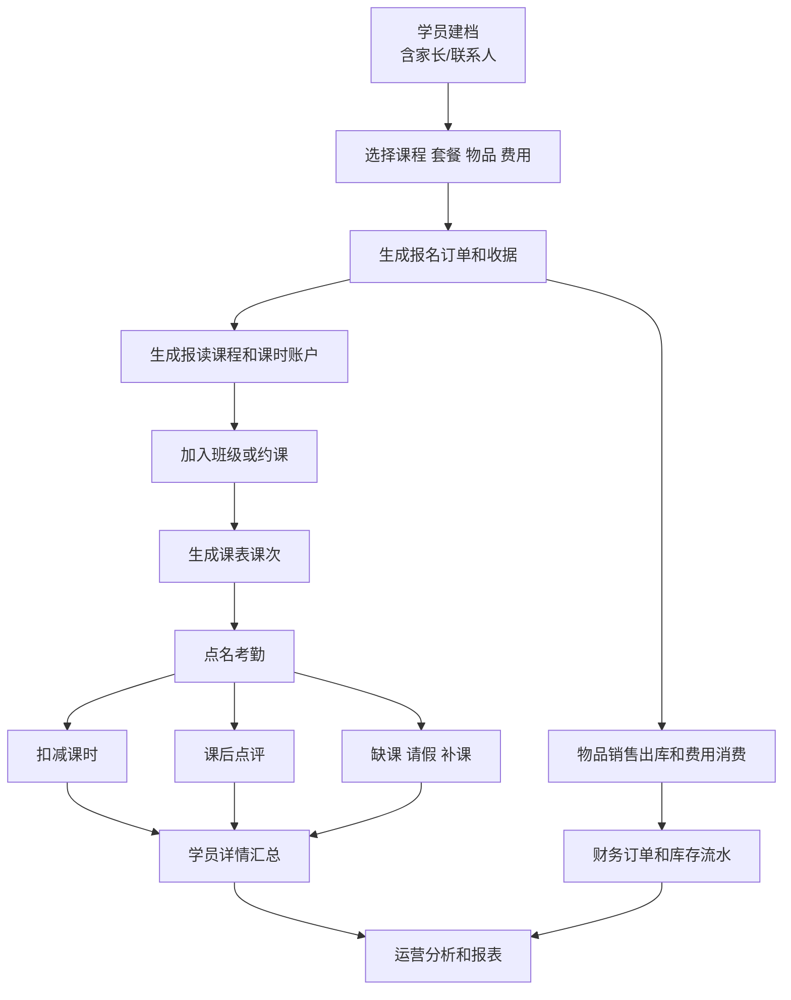
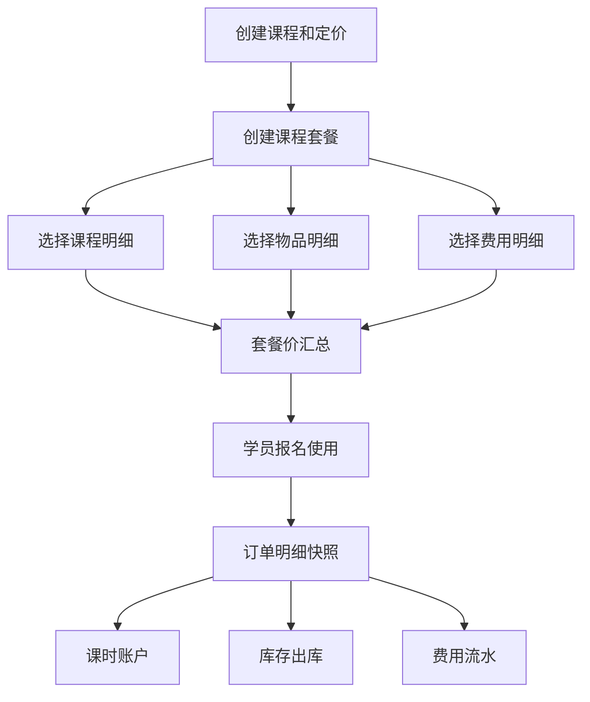
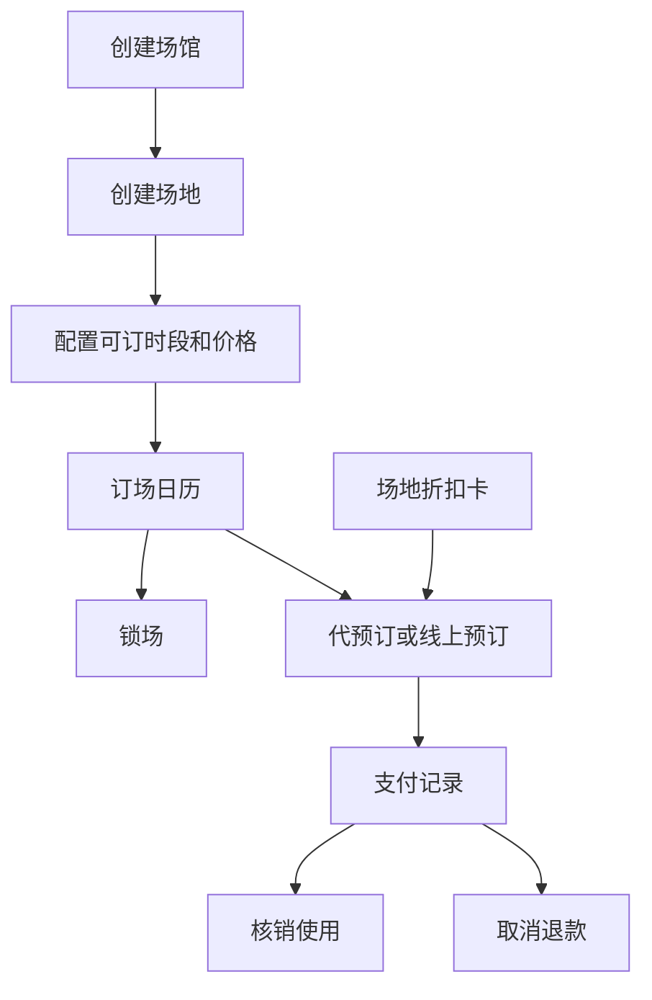

# 老师帮模块关系脑图

> 整理依据：`doc/产品图片` 全部 9 个原型目录及各模块目录内的 `*_模块总结报告.md`、`doc/数据库设计`、`log` 任务记录、`teacher_help_service/logs`。  
> 口径说明：当前 PC 助教业务后台按 9 个原型模块梳理；未发现独立“家长管理”原型，家长信息归入“学员管理”的家长/联系人信息。

## 1. 九模块脑图

## 2. 模块关联图

## 3. 核心业务闭环

## 4. 当前实现状态

| 模块 | 原型覆盖 | 当前代码和日志判断 |
| --- | --- | --- |
| 学员管理 | 38 张，覆盖档案、报名、报读、跟进、消费、持卡、上课记录、转课停课结课 | `assistant/student` 更贴近原型；完整报名订单、课时账户、消费/收据等闭环仍需以当前未提交代码完成后的验证为准 |
| 班级管理 | 31 张，覆盖班级列表、详情、学员、点名、排课、升班结业、一对一 | 前端有 `assistant/class` 页面，数据库设计已覆盖；完整后端班级 Controller 仍需补齐 |
| 课表管理 | 20 张，覆盖时间/老师/教室/班级课表、导出、请假调课、临时学员 | 后端已有 `/teach/schedule/event` 与 `/teach/schedule/attendance`，复杂课表闭环仍需继续对齐原型 |
| 上课记录 | 23 张，覆盖点名、点评、请假、缺课补课、缺课提醒、超时未点名 | 前端有 `assistant/classRecord` 页面；完整点名、点评、请假、缺课补课后端闭环仍需建设 |
| 课程管理 | 11 张，覆盖课程、收费方式、套餐、选择课程/物品/费用 | 2026-06-20 日志显示课程单品、定价、套餐、套餐明细已完成真实前后端闭环 |
| 老师管理 | 7 张，覆盖老师列表、权限、详情、上课记录、签到列表 | `module_teach` 已有教师基础接口；老师权限与系统角色需要继续统一 |
| 物品费用 | 15 张，覆盖费用、物品、SKU、采购、出入库、领用退领、盘点 | `module_ast` 已实现物品、SKU、采购、出入库、费用项目；后续重点是报名订单和财务流水联动 |
| 会员卡 | 8 张，覆盖课程卡、场地折扣卡、详情、发放记录 | 当前主要停留在产品/原型层，未看到对应后端模块和前端业务目录 |
| 场地管理 | 15 张，覆盖场馆、场地、订场、锁场、预订记录、核销、取消 | 当前主要停留在产品/原型层，未看到对应后端模块和前端业务目录 |
| 系统底座 | RuoYi 系统能力 | `module_admin`、系统/监控/工具页面较完整，是权限和审计底座 |

## 5. 日志结论

- `log/2026-06-20-ai-course-module-closure.md`：课程模块第一阶段已闭环，课程、定价、套餐和套餐明细均接入真实前后端；后续关键缺口是报名/订单/支付联动。
- `log/2026-06-11-ai-student-module-closure-analysis.md`：学员完整生命周期闭环尚未完成，缺报名订单、订单明细、课时账户、联系人、标签、跟进、消费记录、收据等核心能力；2026-06-22 工作区已有报名相关未提交代码，需完成后复核。
- `log/2026-06-15-ai-inventory-sku-data-reset.md`：物品 SKU 异常来自历史脏数据，SKU 生成逻辑本身未被判定为错误。
- `teacher_help_service/logs/2026-06-20_error.log`：课程、套餐、物品、费用相关接口多条记录为“获取成功”；主要异常是 Redis 连接被远端关闭后导致请求失败，随后服务重启并成功连接数据库和 Redis。
- `teacher_help_service/logs/backend.err.log`：仍存在既有 Pydantic alias warning，后续改 VO 字段时要继续留意 `Field`、alias 和 camelCase 输出方式。
