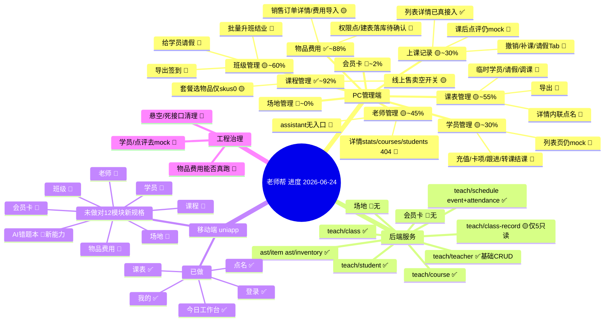

# 老师帮 — 当前进度报告（2026-06-24）

> 生成时间：2026-06-24
> 核查方式：基于 `git log` 最新「最新版」提交（2026-06-24 09:32）+ 逐项代码核实（PC `teacher_help_admin`、后端 `teacher_help_service`、移动端 `teacher_help_uniapp`、原型 `doc/产品图片`、移动原型 `mobile-promete`）。
> 性质：只读核查，未修改任何业务代码。本文在 `项目完成度总结_2026-06-23.md` / `原型全量核对与完成度修正_2026-06-23.md` 基础上，补充今天提交带来的两处变化（上课记录后端落地、移动端 12 模块原型规格新增）。

---

## 一、总体结论

项目处于「**PC 端教学主链路基础可用，移动端刚起步**」阶段。

今天「最新版」提交做了两件事：
1. 落地上课记录后端 `/teach/class-record`（5 个只读接口），并把 PC `classRecord` 列表/详情从 mock 切到真实接口。
2. **新增 12 模块移动端原型规格 `mobile-promete/`**，把移动端目标范围首次定义清楚——而移动端实现只覆盖其中约 5 个模块。

| 端 | 完成度（粗估） | 一句话 |
| --- | ---: | --- |
| 后端服务 | ~85% | 10 个业务 Controller 分层完整；上课记录仅只读、会员卡/场地为零 |
| PC 管理端 | ~60% | 4 模块真接入；学员列表 + 上课记录点评仍 mock；老师无入口 |
| 移动端 uniapp | ~30% | 仅登录/今日/课表/点名/我的，对 12 模块新规格缺 7~8 个 |

---

## 二、完成度脑图（含状态标记）

> 图例：✅ 基本完成　🟡 进行中/部分　🔴 未做或悬空

---

## 三、按模块缺口明细（已逐项核实）

| 模块 | 现状 | 还差什么 | 关键证据 |
| --- | --- | --- | --- |
| 课程管理 | ✅ ~92% | 线上售卖空开关、套餐选物品只取 `skus[0]`、在读人数未联动 | `assistant/course` 真接入 |
| 物品/费用 | ✅ ~88% | 销售订单详情页、费用导入；⚠️ **`ast:*` 权限点与 8 张 `ast_*` 表建表脚本是否落库未确认** | `assistant/inventory` 真接入 |
| 班级管理 | 🟡 ~60% | 批量(导入/升班/结业)、给学员请假、导出签到全缺 | `assistant/class` 真接入 |
| 课表管理 | 🟡 ~55% | 详情内联点名、临时学员、请假、单生调课、导出全缺（后端 checkin/manual/stat 已现成） | `assistant/schedule` 主体真接入 |
| 学员管理 | 🟡 ~30-35% | **列表页整页 mock**（`index.vue:770` mockData，后端 `listStudent` 现成却未接）；充值/卡项/跟进/转课/结课全缺 | 报名/详情已真接入 |
| 上课记录 | 🟡 ~30% | 列表/详情已真接入；**`comment.vue`/`evaluate.vue` 点评仍 mock（TODO 桩）**；撤销点名、补课操作、请假 Tab 全缺 | 后端 `/teach/class-record` 5 只读接口 |
| 老师管理 | 🟡 ~45% | **assistant 侧无入口/菜单**；详情 `stats`/`courses`/`students` 三个死接口仍 404 | 后端 `/teach/teacher` CRUD 完整 |
| 会员卡 | 🔴 ~2% | 前后端全空，仅 `student/detail.vue:196` 一处占位 | — |
| 场地管理 | 🔴 ~0-3% | 前后端全空，仅 `classroom` 文本字段勉强代替 | — |

---

## 四、必须先处理的悬空/死接口（运行期 404 或误导）

核实后仍存在：

1. `classRecord.js:86,95` — `listLeaveApplication` / `listLeaveReason` 仍指向旧前缀 `/assistant/classRecord/leave/*`，**后端无此路由**。
2. `classRecord.js` 的 `add/update/del/export AttendanceRecord` — 调 `/teach/class-record/attendance*`，但**该 Controller 仅 5 个 GET，无写接口**，属空桩。
3. 老师详情 `/teach/teacher/{id}/stats`、`/courses`、`/students` — **后端确认不存在，请求 404**。
4. 课表 `exportScheduleEvent` → `/teach/schedule/event/export` — 后端无 endpoint。

> 处理建议：逐个二选一——补后端实现，或删前端桩并统一到 `/teach/...`。

---

## 五、移动端：新规格 vs 实现（差距最大的新发现）

`mobile-promete/` 今天新增，明确 **12 个移动模块**。当前 `teacher_help_uniapp` 实现：

- ✅ 已做（5）：登录、今日工作台、课表、点名（在 `schedule/detail.vue` 内）、我的。
- 🔴 完全没做（7+）：学员、**AI 错题本**（拍照上传 + AI 解析，纯新增能力）、班级、课程、老师、物品费用、会员卡、场地。

`src/pages` 仅 `index/login/me/schedule`；`src/api` 仅 `login/schedule/attendance/mobile`。

---

## 六、下一步优先级路线图

**P0 工程治理（先稳「能跑」与「接口一致」）**
1. 核实物品费用 `ast:*` 权限点 + 8 张 `ast_*` 表是否落库（否则整模块跑不起来）。
2. 清理第四节 4 类悬空/死接口。

**P0 去 mock（修「看起来做了实际没做」）**
3. 学员列表接真实 `listStudent`（后端现成，性价比最高）。
4. 上课记录课后点评真实化（建点评表 + 写接口）。

**P1 高频教务**
5. 请假能力：班级/课表/上课记录三处共用一套（实体 + service + controller + 抽屉 UI）。
6. 课次详情内联点名（对接现成 checkin/manual/stat）。
7. 老师管理 PC 入口 + 修 3 个 404。
8. 导出签到名单/课表。

**P2 新业务域（暂缓）**
9. 会员卡（先课程卡全链路）→ 场地管理（依赖会员卡折扣卡，必须最后做）。
10. 移动端按 `mobile-promete` 顺序逐模块补；AI 错题本为新能力需单独评估。

---

## 七、与既有文档的关系

- 本文与 `项目完成度总结_2026-06-23.md`、`原型全量核对与完成度修正_2026-06-23.md` 结论一致，并补充：
  - 上课记录后端已从「悬空」变为「5 个只读接口已注册并真接入列表/详情」。
  - 移动端目标范围已由 `mobile-promete/` 明确为 12 模块，实现完成度对新分母约 30%。
- 完整模块关联与业务闭环脑图见 `老师帮-模块关系脑图.md`，本文脑图聚焦「完成度状态」。
