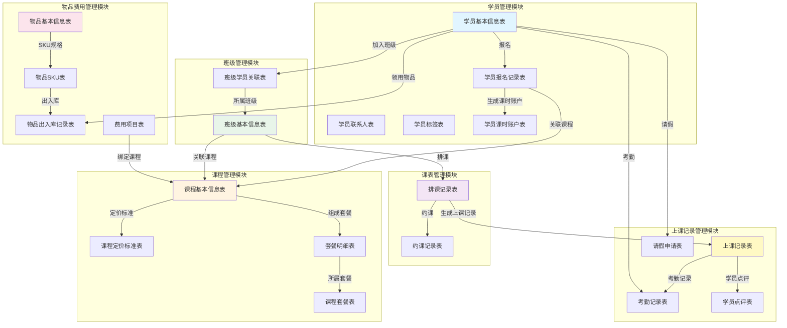

# 助教模块数据库设计总览

## 📋 文档信息

| 项目 | 内容 |
|------|------|
| 文档版本 | V1.0 |
| 创建日期 | 2025-01-11 |
| 创建人 | 数据库架构师 |
| 文档类型 | 数据库设计总览文档 |
| 适用系统 | 老师帮后台管理系统 - 助教管理模块 |

## 📖 目录

- [1. 模块概述](#1-模块概述)
- [2. 模块关联关系](#2-模块关联关系)
- [3. 数据表清单](#3-数据表清单)
- [4. 数据字典清单](#4-数据字典清单)
- [5. 设计规范](#5-设计规范)

---

## 1. 模块概述

### 1.1 业务背景

助教管理模块是老师帮后台管理系统的核心业务模块,负责教育培训机构的日常教学管理工作。该模块涵盖学员管理、课程管理、班级管理、物品费用管理、课表管理和上课记录管理六大子模块。

### 1.2 模块划分

| 序号 | 模块名称 | 模块代码 | 核心功能 | 数据表数量 |
|------|---------|---------|---------|-----------|
| 1 | 学员管理模块 | student | 学员档案、报名信息、课时管理 | 5 |
| 2 | 课程管理模块 | course | 课程模板、课包、定价标准 | 6 |
| 3 | 班级管理模块 | class | 班课、一对一班级管理 | 3 |
| 4 | 物品费用管理模块 | inventory | 物品、出入库、费用管理 | 5 |
| 5 | 课表管理模块 | schedule | 排课、约课、课表展示 | 2 |
| 6 | 上课记录管理模块 | classRecord | 考勤、点评、请假管理 | 4 |
| **合计** | - | - | - | **25** |

---

## 2. 模块关联关系

### 2.1 模块关联关系图



### 2.2 核心业务流程

#### 2.2.1 学员报名流程
```
学员信息录入 → 选择课程/套餐 → 生成报名记录 → 创建课时账户 → 分配班级
```

#### 2.2.2 排课上课流程
```
创建班级 → 排课 → 学员约课 → 生成上课记录 → 考勤点名 → 扣减课时 → 学员点评
```

#### 2.2.3 物品管理流程
```
创建物品 → 设置SKU → 采购入库 → 学员领用 → 出库记录
```

---

## 3. 数据表清单

### 3.1 学员管理模块 (5张表)

| 序号 | 表名 | 中文名称 | 说明 |
|------|------|---------|------|
| 1 | `ast_student` | 学员基本信息表 | 存储学员的基本档案信息 |
| 2 | `ast_student_contact` | 学员联系人表 | 存储学员的联系人信息(主要联系人+备用联系人) |
| 3 | `ast_student_tag` | 学员标签表 | 存储学员的标签信息(多对多关系) |
| 4 | `ast_student_enrollment` | 学员报名记录表 | 存储学员的课程报名信息 |
| 5 | `ast_student_course_account` | 学员课时账户表 | 存储学员的课时余额和消费记录 |

### 3.2 课程管理模块 (6张表)

| 序号 | 表名 | 中文名称 | 说明 |
|------|------|---------|------|
| 1 | `ast_course` | 课程基本信息表 | 存储课程模板的基本信息 |
| 2 | `ast_course_price` | 课程定价标准表 | 存储课程的定价标准(按课时/按月/按天) |
| 3 | `ast_course_package` | 课程套餐表 | 存储课程套餐的基本信息 |
| 4 | `ast_package_item` | 套餐明细表 | 存储套餐包含的课程/物品/费用明细 |
| 5 | `ast_course_deduct_rule` | 课程扣课规则表 | 存储课程的扣课时规则配置 |
| 6 | `ast_course_grade_config` | 课程年级配置表 | 存储课程适用的年级配置 |

### 3.3 班级管理模块 (3张表)

| 序号 | 表名 | 中文名称 | 说明 |
|------|------|---------|------|
| 1 | `ast_class` | 班级基本信息表 | 存储班级的基本信息 |
| 2 | `ast_class_student` | 班级学员关联表 | 存储班级与学员的多对多关系 |
| 3 | `ast_class_teacher` | 班级教师关联表 | 存储班级与教师的关联关系 |

### 3.4 物品费用管理模块 (5张表)

| 序号 | 表名 | 中文名称 | 说明 |
|------|------|---------|------|
| 1 | `ast_item` | 物品基本信息表 | 存储物品的基本信息 |
| 2 | `ast_item_sku` | 物品SKU表 | 存储物品的规格信息 |
| 3 | `ast_item_stock_record` | 物品出入库记录表 | 存储物品的出入库流水记录 |
| 4 | `ast_fee_item` | 费用项目表 | 存储费用项目的基本信息 |
| 5 | `ast_fee_record` | 费用收取记录表 | 存储费用的收取记录 |

### 3.5 课表管理模块 (2张表)

| 序号 | 表名 | 中文名称 | 说明 |
|------|------|---------|------|
| 1 | `ast_schedule` | 排课记录表 | 存储课程的排课信息 |
| 2 | `ast_booking` | 约课记录表 | 存储学员的约课信息 |

### 3.6 上课记录管理模块 (4张表)

| 序号 | 表名 | 中文名称 | 说明 |
|------|------|---------|------|
| 1 | `ast_class_record` | 上课记录表 | 存储每次上课的基本记录 |
| 2 | `ast_attendance_record` | 考勤记录表 | 存储学员的考勤详细记录 |
| 3 | `ast_student_comment` | 学员点评表 | 存储教师对学员的点评记录 |
| 4 | `ast_leave_application` | 请假申请表 | 存储学员的请假申请记录 |

---

## 4. 数据字典清单

### 4.1 通用字典

| 字典类型代码 | 字典类型名称 | 说明 |
|-------------|------------|------|
| `sys_normal_disable` | 系统状态 | 0=停用, 1=启用 |
| `sys_yes_no` | 系统是否 | 0=否, 1=是 |
| `sys_user_sex` | 用户性别 | 0=未知, 1=男, 2=女 |

### 4.2 学员管理字典

| 字典类型代码 | 字典类型名称 | 说明 |
|-------------|------------|------|
| `ast_student_source` | 学员来源 | 线上推广、线下推广、老学员推荐、其他 |
| `ast_student_status` | 学员状态 | 1=在读, 2=已退学, 3=暂停 |
| `ast_contact_relation` | 联系人关系 | 妈妈、爸爸、爷爷、奶奶、其他 |
| `ast_grade` | 年级 | 一年级~高三 |
| `ast_card_status` | 绑卡状态 | 0=未绑卡, 1=已绑卡 |
| `ast_face_status` | 人脸采集状态 | 0=未采集, 1=已采集 |

### 4.3 课程管理字典

| 字典类型代码 | 字典类型名称 | 说明 |
|-------------|------------|------|
| `ast_course_type` | 课程类型 | 1=一对多, 2=一对一 |
| `ast_subject` | 科目 | 语文、数学、英语、物理、化学等 |
| `ast_semester` | 学期 | 1=春季, 2=夏季, 3=秋季, 4=冬季 |
| `ast_charge_type` | 收费方式 | 1=按课时, 2=按月, 3=按天 |
| `ast_deduct_rule` | 扣课规则 | 1=满课最多扣除, 2=扣1, 3=不扣, 4=部分免扣 |

### 4.4 班级管理字典

| 字典类型代码 | 字典类型名称 | 说明 |
|-------------|------------|------|
| `ast_class_type` | 班级类型 | system=系统班型, custom=自建班型 |
| `ast_enroll_status` | 招生状态 | 1=招生中, 2=已满员, 3=已结课 |

### 4.5 物品费用字典

| 字典类型代码 | 字典类型名称 | 说明 |
|-------------|------------|------|
| `ast_item_type` | 物品类型 | 1=实物, 2=虚拟 |
| `ast_business_type` | 业务类型 | purchase=采购, receive=领用, return=退领, inventory=盘点 |
| `ast_role_type` | 角色类型 | teacher=教师, student=学生, admin=管理员 |

### 4.6 上课记录字典

| 字典类型代码 | 字典类型名称 | 说明 |
|-------------|------------|------|
| `ast_attendance_status` | 考勤状态 | 1=出勤, 2=缺勤, 3=请假, 4=迟到, 5=早退 |
| `ast_leave_status` | 请假状态 | 1=待审批, 2=已通过, 3=已拒绝 |
| `ast_leave_type` | 请假类型 | 1=事假, 2=病假, 3=其他 |

---

## 5. 设计规范

### 5.1 命名规范

#### 5.1.1 表名规范
- **前缀**: 所有助教模块表统一使用 `ast_` 前缀 (assistant的缩写)
- **命名风格**: 使用下划线命名法 (snake_case)
- **示例**: `ast_student`, `ast_course`, `ast_class_record`

#### 5.1.2 字段名规范
- **命名风格**: 使用下划线命名法 (snake_case)
- **外键字段**: 统一使用 `关联表名_id` 格式,如 `student_id`, `course_id`
- **状态字段**: 统一使用 `status` 命名
- **时间字段**: 创建时间 `create_time`, 更新时间 `update_time`

### 5.2 字段类型规范

| 数据类型 | 使用场景 | 示例 |
|---------|---------|------|
| `BIGINT` | 主键ID、外键ID | `id`, `student_id` |
| `VARCHAR(n)` | 字符串字段 | `student_name VARCHAR(50)` |
| `TEXT` | 长文本字段 | `remark TEXT` |
| `TINYINT` | 状态、类型字段 | `status TINYINT(1)` |
| `DECIMAL(10,2)` | 金额字段 | `price DECIMAL(10,2)` |
| `INT` | 数量、次数字段 | `quantity INT` |
| `DATETIME` | 日期时间字段 | `create_time DATETIME` |
| `DATE` | 日期字段 | `birthday DATE` |

### 5.3 系统字段规范

每个表必须包含以下系统字段:

```sql
`id` BIGINT NOT NULL AUTO_INCREMENT COMMENT '主键ID',
`create_by` VARCHAR(64) DEFAULT '' COMMENT '创建者',
`create_time` DATETIME DEFAULT CURRENT_TIMESTAMP COMMENT '创建时间',
`update_by` VARCHAR(64) DEFAULT '' COMMENT '更新者',
`update_time` DATETIME DEFAULT CURRENT_TIMESTAMP ON UPDATE CURRENT_TIMESTAMP COMMENT '更新时间',
`remark` VARCHAR(500) DEFAULT NULL COMMENT '备注',
`del_flag` TINYINT(1) DEFAULT 0 COMMENT '删除标志(0=正常,1=删除)',
PRIMARY KEY (`id`)
```

### 5.4 索引规范

#### 5.4.1 主键索引
- 每个表必须有主键,统一使用 `id` 字段
- 主键类型为 `BIGINT AUTO_INCREMENT`

#### 5.4.2 普通索引
- 外键字段必须建立索引,命名格式: `idx_字段名`
- 常用查询字段建立索引
- 示例: `INDEX idx_student_id (student_id)`

#### 5.4.3 唯一索引
- 需要保证唯一性的字段建立唯一索引
- 命名格式: `uk_字段名`
- 示例: `UNIQUE KEY uk_student_no (student_no)`

#### 5.4.4 联合索引
- 多字段组合查询建立联合索引
- 命名格式: `idx_字段1_字段2`
- 示例: `INDEX idx_class_id_student_id (class_id, student_id)`

### 5.5 数据库引擎和字符集

```sql
ENGINE=InnoDB DEFAULT CHARSET=utf8mb4 COLLATE=utf8mb4_unicode_ci
```

- **存储引擎**: InnoDB (支持事务和外键)
- **字符集**: utf8mb4 (支持emoji等特殊字符)
- **排序规则**: utf8mb4_unicode_ci

---

## 6. 后续文档

详细的表结构设计请参考各子模块的设计文档:

1. [学员管理模块数据库设计](./01-学员管理模块数据库设计.md)
2. [课程管理模块数据库设计](./02-课程管理模块数据库设计.md)
3. [班级管理模块数据库设计](./03-班级管理模块数据库设计.md)
4. [物品费用管理模块数据库设计](./04-物品费用管理模块数据库设计.md)
5. [课表管理模块数据库设计](./05-课表管理模块数据库设计.md)
6. [上课记录管理模块数据库设计](./06-上课记录管理模块数据库设计.md)

---

**文档结束**

