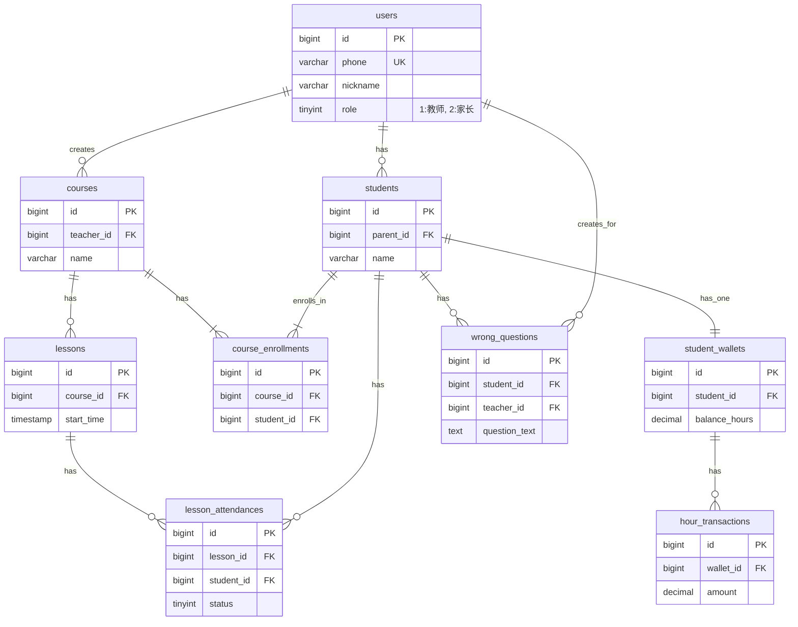

# 老师帮APP - 数据库设计文档 (V1.0)

## 1. 概述

本设计文档旨在为“老师帮”APP及其PC管理后台提供一个全面、可扩展的数据库解决方案。方案采用 **MySQL**作为主要的关系型数据存储，并引入 **Redis**作为高性能的缓存和消息队列中间件，以满足系统的性能和实时性需求。

## 2. Redis 使用分析

在系统中引入Redis并非可选，而是为了提升核心用户体验和系统性能的必要组件。其主要应用场景如下：

| 场景             | 为什么使用Redis                                                                                                  | 具体实现                                                                                                                  |
| ---------------- | ---------------------------------------------------------------------------------------------------------------- | ------------------------------------------------------------------------------------------------------------------------- |
| **用户会话管理**   | **高性能读写**：用户登录后，将生成的`token`与用户信息关联存储在Redis中，后续请求只需验证Redis中的`token`，无需每次都查询数据库，极大提升API响应速度。 | `SETEX user:session:<token> <user_id> 3600*24*7` (存储用户ID，设置7天过期)                                                    |
| **核心数据缓存**   | **降低DB压力**：教师工作台（首页）的核心数据（今日课程、本月收入等）和一些不常变化的配置信息（如科目列表），可以被缓存，避免高频次的复杂数据库查询。 | `HSET dashboard:<teacher_id> 'today_courses' '...'` <br> `GET config:subjects`                                            |
| **实时签到通知**   | **实时通信**：当学生/家长扫码签到时，后端可以将签到成功的消息发布到特定频道。教师端APP订阅该频道，即可实现签到列表的无刷新实时更新，体验极佳。  | **Redis Pub/Sub**：<br> 1. 教师端APP连接后订阅频道 `lesson:checkin:<lesson_id>`。<br> 2. 学生签到后，后端 `PUBLISH lesson:checkin:<lesson_id> '{"student_id": "xxx", "status": "present"}'`。 |
| **分布式锁**     | **保证数据一致性**：在并发场景下（如多个操作同时扣减课时），使用Redis的`SETNX`命令可以实现分布式锁，确保同一时间只有一个操作能执行，防止数据错乱。 | `SET lock:student_wallet:<student_id> "1" NX EX 10` (尝试获取锁，10秒后自动释放)                                               |
| **API接口限流**    | **防止恶意请求**：记录特定用户或IP在单位时间内的API请求次数，用于防止短信轰炸、暴力破解等攻击。                                           | `INCR api_limit:<user_id>:<api_path>` <br> `EXPIRE ...`                                                                  |

**结论**：**Redis是必需的**。它解决了系统对高性能、高并发和实时性的要求，是构建现代化、高体验感应用的关键一环。

## 3. MySQL 数据库表结构设计

所有表均使用 `InnoDB` 存储引擎以支持事务和外键。字符集统一使用 `utf8mb4` 以支持emoji表情等特殊字符。主键统一使用 `BIGINT` 类型的 `id`，并自增。

---

### 3.1 用户与账户核心表

#### 1. `users` - 用户表
存储所有APP用户（教师、家长）。
```sql
CREATE TABLE `users` (
  `id` bigint unsigned NOT NULL AUTO_INCREMENT COMMENT '主键ID',
  `phone` varchar(20) NOT NULL COMMENT '手机号，唯一登录凭证',
  `password_hash` varchar(255) NOT NULL COMMENT '加盐哈希后的密码',
  `nickname` varchar(50) DEFAULT NULL COMMENT '用户昵称',
  `avatar_url` varchar(512) DEFAULT NULL COMMENT '头像URL',
  `role` tinyint(1) NOT NULL COMMENT '角色: 1-教师, 2-家长',
  `status` tinyint(1) NOT NULL DEFAULT '1' COMMENT '状态: 1-正常, 2-禁用',
  `created_at` timestamp NOT NULL DEFAULT CURRENT_TIMESTAMP COMMENT '创建时间',
  `updated_at` timestamp NOT NULL DEFAULT CURRENT_TIMESTAMP ON UPDATE CURRENT_TIMESTAMP COMMENT '更新时间',
  PRIMARY KEY (`id`),
  UNIQUE KEY `uk_phone` (`phone`)
) ENGINE=InnoDB DEFAULT CHARSET=utf8mb4 COLLATE=utf8mb4_unicode_ci COMMENT='用户表';
```

#### 2. `students` - 学生表
存储学生档案信息，与家长用户关联。
```sql
CREATE TABLE `students` (
  `id` bigint unsigned NOT NULL AUTO_INCREMENT COMMENT '主键ID',
  `parent_id` bigint unsigned NOT NULL COMMENT '关联的家长用户ID (users.id)',
  `name` varchar(50) NOT NULL COMMENT '学生姓名',
  `gender` tinyint(1) DEFAULT '0' COMMENT '性别: 0-未知, 1-男, 2-女',
  `birthday` date DEFAULT NULL COMMENT '出生日期',
  `notes` text COMMENT '教师备注（如性格特点、过敏史等）',
  `created_at` timestamp NOT NULL DEFAULT CURRENT_TIMESTAMP,
  `updated_at` timestamp NOT NULL DEFAULT CURRENT_TIMESTAMP ON UPDATE CURRENT_TIMESTAMP,
  PRIMARY KEY (`id`),
  KEY `idx_parent_id` (`parent_id`)
) ENGINE=InnoDB DEFAULT CHARSET=utf8mb4 COLLATE=utf8mb4_unicode_ci COMMENT='学生档案表';
```

---

### 3.2 课程与教学核心表

#### 3. `courses` - 课程模板表
定义一门课程的静态属性，如“周一下午的数学提高班”。
```sql
CREATE TABLE `courses` (
  `id` bigint unsigned NOT NULL AUTO_INCREMENT COMMENT '主键ID',
  `teacher_id` bigint unsigned NOT NULL COMMENT '所属教师ID (users.id)',
  `name` varchar(100) NOT NULL COMMENT '课程名称',
  `subject` varchar(50) DEFAULT NULL COMMENT '科目',
  `description` text COMMENT '课程描述',
  `status` tinyint(1) NOT NULL DEFAULT '1' COMMENT '状态: 1-开课中, 2-已结课',
  `created_at` timestamp NOT NULL DEFAULT CURRENT_TIMESTAMP,
  `updated_at` timestamp NOT NULL DEFAULT CURRENT_TIMESTAMP ON UPDATE CURRENT_TIMESTAMP,
  PRIMARY KEY (`id`),
  KEY `idx_teacher_id` (`teacher_id`)
) ENGINE=InnoDB DEFAULT CHARSET=utf8mb4 COLLATE=utf8mb4_unicode_ci COMMENT='课程模板表';
```

#### 4. `course_enrollments` - 课程报名表
记录学生与课程的报名关系 (多对多)。
```sql
CREATE TABLE `course_enrollments` (
  `id` bigint unsigned NOT NULL AUTO_INCREMENT,
  `course_id` bigint unsigned NOT NULL COMMENT '课程ID',
  `student_id` bigint unsigned NOT NULL COMMENT '学生ID',
  `status` tinyint(1) NOT NULL DEFAULT '1' COMMENT '报名状态: 1-在读, 2-已退课',
  `enrolled_at` timestamp NOT NULL DEFAULT CURRENT_TIMESTAMP COMMENT '报名时间',
  PRIMARY KEY (`id`),
  UNIQUE KEY `uk_course_student` (`course_id`, `student_id`),
  KEY `idx_student_id` (`student_id`)
) ENGINE=InnoDB DEFAULT CHARSET=utf8mb4 COLLATE=utf8mb4_unicode_ci COMMENT='课程报名表';
```

#### 5. `lessons` - 课节表
课程模板的具体实例，即每一节具体的课。
```sql
CREATE TABLE `lessons` (
  `id` bigint unsigned NOT NULL AUTO_INCREMENT COMMENT '主键ID',
  `course_id` bigint unsigned NOT NULL COMMENT '所属课程ID',
  `teacher_id` bigint unsigned NOT NULL COMMENT '上课教师ID (冗余字段方便查询)',
  `start_time` timestamp NOT NULL COMMENT '上课开始时间',
  `end_time` timestamp NOT NULL COMMENT '上课结束时间',
  `status` tinyint(1) NOT NULL DEFAULT '1' COMMENT '课节状态: 1-已安排, 2-进行中, 3-已完成, 4-已取消',
  `created_at` timestamp NOT NULL DEFAULT CURRENT_TIMESTAMP,
  `updated_at` timestamp NOT NULL DEFAULT CURRENT_TIMESTAMP ON UPDATE CURRENT_TIMESTAMP,
  PRIMARY KEY (`id`),
  KEY `idx_course_id` (`course_id`),
  KEY `idx_teacher_id_start_time` (`teacher_id`, `start_time`)
) ENGINE=InnoDB DEFAULT CHARSET=utf8mb4 COLLATE=utf8mb4_unicode_ci COMMENT='课节表';
```

#### 6. `lesson_attendances` - 考勤记录表
记录每位学生在每节课的出勤情况。
```sql
CREATE TABLE `lesson_attendances` (
  `id` bigint unsigned NOT NULL AUTO_INCREMENT,
  `lesson_id` bigint unsigned NOT NULL COMMENT '课节ID',
  `student_id` bigint unsigned NOT NULL COMMENT '学生ID',
  `status` tinyint(1) NOT NULL DEFAULT '0' COMMENT '考勤状态: 0-未签到, 1-出勤, 2-迟到, 3-请假, 4-缺勤',
  `check_in_time` timestamp NULL DEFAULT NULL COMMENT '签到时间',
  `notes` varchar(255) DEFAULT NULL COMMENT '备注（如请假原因）',
  PRIMARY KEY (`id`),
  UNIQUE KEY `uk_lesson_student` (`lesson_id`, `student_id`)
) ENGINE=InnoDB DEFAULT CHARSET=utf8mb4 COLLATE=utf8mb4_unicode_ci COMMENT='考勤记录表';
```

---

### 3.3 学习与财务核心表

#### 7. `student_wallets` - 学生课时钱包表
记录每个学生总的剩余课时。
```sql
CREATE TABLE `student_wallets` (
  `id` bigint unsigned NOT NULL AUTO_INCREMENT,
  `student_id` bigint unsigned NOT NULL COMMENT '学生ID',
  `balance_hours` decimal(10,2) NOT NULL DEFAULT '0.00' COMMENT '剩余课时数',
  `updated_at` timestamp NOT NULL DEFAULT CURRENT_TIMESTAMP ON UPDATE CURRENT_TIMESTAMP,
  PRIMARY KEY (`id`),
  UNIQUE KEY `uk_student_id` (`student_id`)
) ENGINE=InnoDB DEFAULT CHARSET=utf8mb4 COLLATE=utf8mb4_unicode_ci COMMENT='学生课时钱包表';
```

#### 8. `hour_transactions` - 课时流水表
记录每一次课时的增加或扣除，用于对账。
```sql
CREATE TABLE `hour_transactions` (
  `id` bigint unsigned NOT NULL AUTO_INCREMENT,
  `wallet_id` bigint unsigned NOT NULL COMMENT '钱包ID',
  `student_id` bigint unsigned NOT NULL COMMENT '学生ID (冗余)',
  `amount` decimal(10,2) NOT NULL COMMENT '交易课时数（正为增加，负为扣除）',
  `balance_after` decimal(10,2) NOT NULL COMMENT '交易后余额',
  `type` tinyint(1) NOT NULL COMMENT '交易类型: 1-购买, 2-上课扣除, 3-后台调整, 4-退款',
  `related_lesson_id` bigint unsigned DEFAULT NULL COMMENT '关联的课节ID (如果是上课扣除)',
  `notes` varchar(255) DEFAULT NULL COMMENT '交易备注',
  `created_at` timestamp NOT NULL DEFAULT CURRENT_TIMESTAMP,
  PRIMARY KEY (`id`),
  KEY `idx_wallet_id` (`wallet_id`)
) ENGINE=InnoDB DEFAULT CHARSET=utf8mb4 COLLATE=utf8mb4_unicode_ci COMMENT='课时流水表';
```

#### 9. `wrong_questions` - 错题本表
存储学生个人的错题记录。
```sql
CREATE TABLE `wrong_questions` (
  `id` bigint unsigned NOT NULL AUTO_INCREMENT,
  `student_id` bigint unsigned NOT NULL COMMENT '所属学生ID',
  `teacher_id` bigint unsigned NOT NULL COMMENT '录入教师ID',
  `subject` varchar(50) DEFAULT NULL COMMENT '科目',
  `question_text` text COMMENT '题目文本内容',
  `question_image_url` varchar(512) DEFAULT NULL COMMENT '题目图片URL',
  `answer_text` text COMMENT '答案解析文本',
  `mastery_level` tinyint(1) NOT NULL DEFAULT '1' COMMENT '掌握程度: 1-未掌握, 2-已了解, 3-已掌握',
  `created_at` timestamp NOT NULL DEFAULT CURRENT_TIMESTAMP,
  PRIMARY KEY (`id`),
  KEY `idx_student_id` (`student_id`)
) ENGINE=InnoDB DEFAULT CHARSET=utf8mb4 COLLATE=utf8mb4_unicode_ci COMMENT='错题本表';
```

---

### 3.4 后台管理系统表

#### 10. `admin_users` - 后台管理员表
```sql
CREATE TABLE `admin_users` (
  `id` int unsigned NOT NULL AUTO_INCREMENT,
  `username` varchar(50) NOT NULL COMMENT '用户名',
  `password_hash` varchar(255) NOT NULL,
  `name` varchar(50) DEFAULT NULL COMMENT '姓名',
  `role_id` int unsigned NOT NULL COMMENT '角色ID',
  `status` tinyint(1) NOT NULL DEFAULT '1' COMMENT '1-正常, 2-禁用',
  `last_login_at` timestamp NULL DEFAULT NULL,
  PRIMARY KEY (`id`),
  UNIQUE KEY `uk_username` (`username`)
) ENGINE=InnoDB DEFAULT CHARSET=utf8mb4 COLLATE=utf8mb4_unicode_ci COMMENT='后台管理员表';
```
*（为简化，`admin_roles` 和 `role_permissions` 权限管理表在此省略，但实际项目中应包含）*


## 4. 实体关系图 (ERD - Mermaid 语法)

以下ERD展示了核心表之间的关系。


*（ERD图例：`||--o{` 表示一对多，`||--||` 表示一对一）*